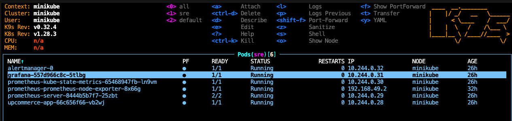
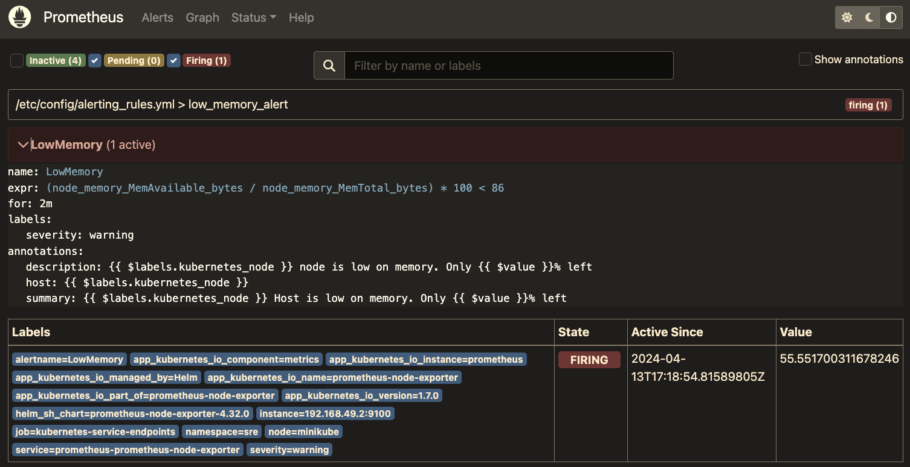
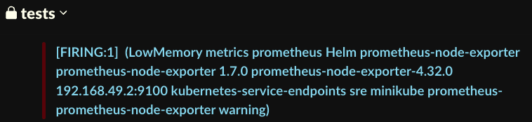
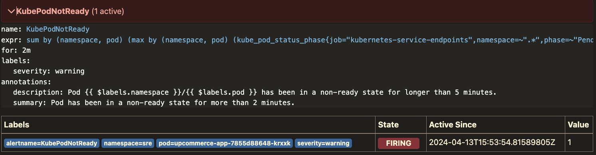

# Kubernetes monitoring with Prometheus and Grafana

This repo shows how to manage alerts from a simple website deployed in a container with Kubernetes.  
Everything is running locally on macOS.

Some setup files are missing because they hold secrets (to be implemented later using Kubernetes secrets).  

Deployment_local_image.yml uses a container created directly inside Kubernetes rather than from dockerhub. 

See the file `allcommands.md` for the followed procedure to set it all up and comments.  

A series of alerts are declared in prometheus.yml.  
The alerts.yml files are not shown since they contain secrets. 

The state of Kubernetes was monitored using k9s.

  

## LowMemory alert
The memory provided is too low which triggers the `LowMemory` alert 

Here's a screenshot taken from the Prometheus server running locally on `localhost:9090`
The AlertManager runs on `localhost:9093`

  

The AlertManager sends a message to Slack every 2 minutes.

  

## KubePodNotReady alert
If we increase 'cpu' in deployment to 10, Prometheus triggers a `KubePodNotReady` alert.

  

'cpu' was set back to 1 to be able to continue.  

# Toil management

## Strategies for Improving Alert Management in Ticketing Systems

## 1. Alert Deduplication
To handle recurring obsolete issues effectively, the system should be capable of recognizing and deduplicating alerts. This means that if multiple instances of the same issue (e.g., "EndpointRegistrationTransientFailure" from the same zone) occur within a short time frame, they should be consolidated into a single ticket or alert.

**Solution:**
- **PagerDuty**: Offers alert deduplication capabilities, reducing noise and focusing on actionable alerts.
- **Opsgenie by Atlassian**: Also provides alert deduplication and integrates well with various monitoring tools.

## 2. Intelligent Prioritization
Alerts should not only be categorized by severity but also prioritized based on impact and urgency. This approach ensures that critical issues are addressed first.

**Solution:**
- **ServiceNow**: Known for its robust ITSM capabilities, ServiceNow allows for the customization of alert rules and prioritization settings.
- **Zendesk**: While primarily a customer service tool, Zendesk can be configured for IT alert management with prioritization based on predefined criteria.

## 3. Root Cause Analysis (RCA)
Tools that facilitate or automate root cause analysis can help in identifying the underlying reasons for frequent and recurring alerts, aiding in their resolution and preventing future occurrences.

**Solution:**
- **Splunk**: Provides powerful log analysis that can help in understanding the underlying causes of alerts.
- **Dynatrace**: Offers AI-powered root cause analysis that can automatically detect and diagnose issues.

## 4. Alert Correlation
Correlating alerts across different zones or systems can help in understanding if disparate alerts are symptoms of a single, larger issue, which can improve response strategies and reduce the handling time.

**Solution:**
- **Moogsoft**: Specializes in AI-driven alert correlation, helping teams to manage alerts more efficiently by reducing fragmentation.
- **BigPanda**: Uses AI to automate incident management, including alert correlation and analysis.

## 5. Automated Response and Self-healing
Implementing automated response systems that can either resolve known issues automatically or provide recommended actions can significantly reduce the load on engineering teams.

**Solution:**
- **Rundeck by PagerDuty**: Allows you to define automated workflows that can be triggered by specific alerts to either fully automate the resolution or guide the operator through a response procedure.
- **Ansible Tower**: Provides automation tools that can be used to deploy self-healing scripts or procedures in response to certain alerts.
- **StackStorm**: An event-driven automation platform that can automatically respond to incoming alerts by executing predefined scripts or workflows.